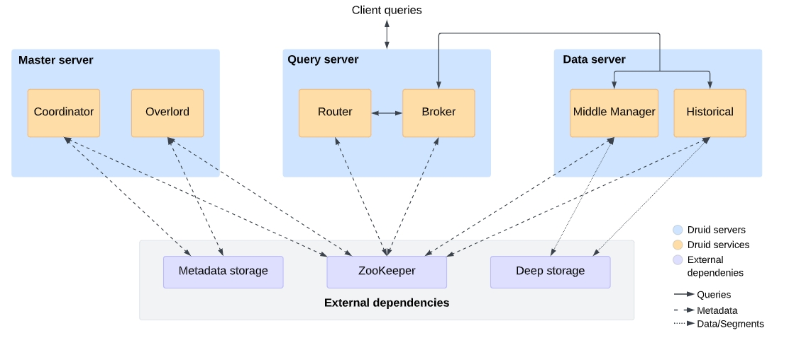

  <h1 align="center">Druid数据库</h1>
  

    <a href="README.md"><strong>English</strong></a> | <strong>简体中文</strong>
  

## 目录

- [仓库简介](#项目介绍)
- [前置条件](#前置条件)
- [镜像说明](#镜像说明)
- [获取帮助](#获取帮助)
- [如何贡献](#如何贡献)

## 项目介绍
[Apache Druid](https://github.com/apache/Druid) 是一个高性能、实时分析数据库，可在大规模和负载下对流式和批处理数据进行亚秒级查询。

**核心特性：**
1. 任何规模的亚秒级查询：在毫秒内对具有数十亿到数万亿行的高基数和高维数据集执行OLAP查询，而无需预先定义或缓存查询。
2. 以最低的成本实现高并发性：构建实时分析应用程序，以一致的性能支持每秒100到100000个查询，采用比其他数据库使用更少基础设施的高效架构。
3. 实时和历史洞察：通过Druid与Apache Kafka和Amazon Kinesis的原生集成，释放流数据的潜力，因为它支持每秒数百万个事件的到达查询、低延迟摄入和有保证的一致性。

**架构设计：**

本项目提供的开源镜像商品 [**Druid数据库**](https://marketplace.huaweicloud.com/hidden)，已预先安装 Druid 软件及其相关运行环境，并提供部署模板。快来参照使用指南，轻松开启“开箱即用”的高效体验吧。

> **系统要求如下：**
> - CPU: 2GHz 或更高
> - RAM: 4GB 或更大
> - Disk: 至少 40GB

## 前置条件
[注册华为账号并开通华为云](https://support.huaweicloud.com/usermanual-account/account_id_001.html)

## 镜像说明

| 镜像规格                                                                                                        | 特性说明                                         | 备注 |
|-------------------------------------------------------------------------------------------------------------|----------------------------------------------| --- |
| [Druid32.0-kunpeng-v1.0](https://github.com/HuaweiCloudDeveloper/Druid-image/tree/Druid32.0-kunpeng-v1.0)  | 基于 鲲鹏服务器 + Huawei Cloud EulerOS 2.0 64bit 安装部署 |  |
| [Druid32.0-kunpeng-v1.0](https://github.com/HuaweiCloudDeveloper/Druid-image/tree/Druid32.0-kunpeng-v1.0) | 基于 鲲鹏服务器 + Ubuntu24.04 64bit 安装部署         |  |

## 获取帮助
- 更多问题可通过 [issue](https://github.com/HuaweiCloudDeveloper/Druid-image/issues) 或 华为云云商店指定商品的服务支持 与我们取得联系
- 其他开源镜像可看 [open-source-image-repos](https://github.com/HuaweiCloudDeveloper/open-source-image-repos)

## 如何贡献
- Fork 此存储库并提交合并请求
- 基于您的开源镜像信息同步更新 README.md
