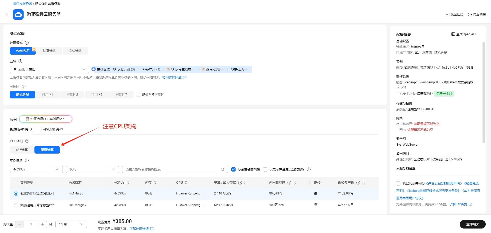
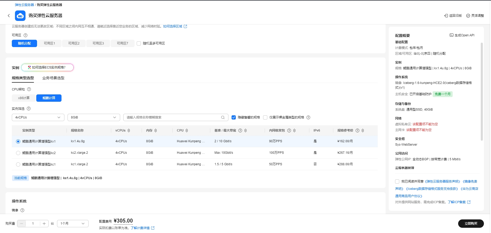
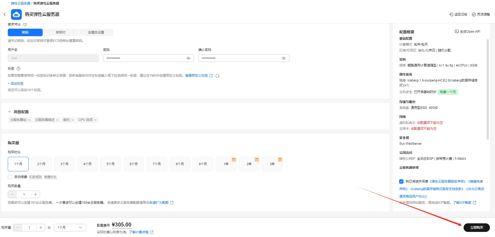

# Druid数据库使用指南

# 一、商品链接

[Druid数据库](https://marketplace.huaweicloud.com/hidden/contents/1bd4a685-14f4-44ca-9d5a-84fb4cc45ecc#productid=OFFI1161477542858375168)

# 二、商品说明

**Apache Druid** 是一个高性能、实时分析数据库，可在大规模和负载下对流式和批处理数据进行亚秒级查询。
# 三、商品购买

您可以在云商店搜索 **Druid数据库**。

其中，地域、规格、推荐配置使用默认，购买方式根据您的需求选择按需/按月/按年，短期使用推荐按需，长期使用推荐按月/按年，确认配置后点击“立即购买”。


## 3.1 使用 RFS 模板直接部署

必填项填写后，点击 下一步


创建直接计划后，点击 确定


点击部署，执行计划

如下图“Apply required resource success. ”即为资源创建完成


##  3.2 ECS 控制台配置

### 准备工作

在使用ECS控制台配置前，需要您提前配置好 **安全组规则**。

> **安全组规则的配置如下：**
> - 入方向规则 放通8888 端口,如指定ip,对应的源地址内必须包含您的客户端ip，否则无法访问 
> - 入方向规则放通 CloudShell 连接实例使用的端口 `22`，以便在控制台登录调试
> - 出方向规则一键放通

### 创建ECS

前提工作准备好后，选择 ECS 控制台配置跳转到[购买ECS](https://support.huaweicloud.com/qs-ecs/ecs_01_0103.html) 页面，ECS 资源的配置如下图所示：

选择CPU架构

选择服务器规格

选择镜像

其他参数根据实际情况进行填写，填写完成之后，点击立即购买即可



> **值得注意的是：**
> - VPC 您可以自行创建
> - 安全组选择 [**准备工作**](#准备工作) 中配置的安全组；
> - 弹性公网IP选择现在购买，推荐选择“按流量计费”，带宽大小可设置为5Mbit/s；
> - 高级配置需要在高级选项支持注入自定义数据，所以登录凭证不能选择“密码”，选择创建后设置；
> - 其余默认或按规则填写即可。

# 四、商品使用

## 修改服务器域名
```shell
vim /etc/hosts
```  
x.x.x.x hadoop1  修改成本机服务器ip

## hadoop用户重新生成免密
* 生成hadoop密码
```shell
passwd hadoop
```

* 删除旧密钥文件  
```shell
su - hadoop  
cd .ssh  
rm -rf id_rsa  id_rsa.pub  known_hosts  
```

* 免密登录
```shell
ssh-keygen -t rsa  
ssh-copy-id hadoop1		-- hadoop 密码 例如 123456  
```

## 启动druid服务
```shell
/opt/module/druid-32.0.1/bin/start-nano-quickstart start
```

## 访问web ui页面，外网ip
http://X.X.X.X:8888/


## 参考文档

[Druid官网](https://Druid.apache.org/)
